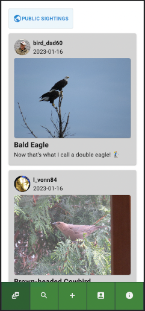
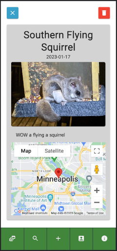
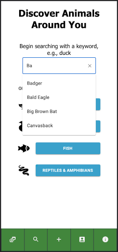
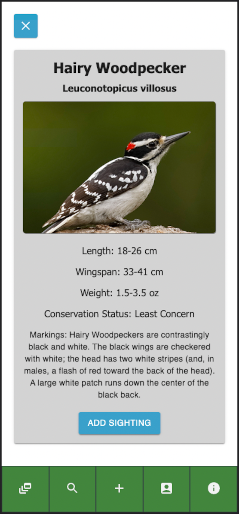
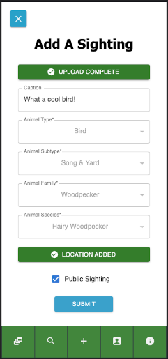

# MN Critter Catcher

## Description

This mobile-first web-based application that helps users to to identify and track animals native to Minnesota. Currently there is a database with entries for 65 animals that can be searched directly or through a system of intuitive filters. Each species has a detailed page including photos, descriptions of markings, lengths, weights and wingspans to help user identify unknown critters. 

Users have a personal sighting feed that lists all of the animals they've seen along with access to a public feed where they can view sighting posts from other users. Detailed sighting views may include an image, caption and Google maps integration with a marker indicating where the critter was spotted. 

The Add A Sighting page can be accessed from either a detailed species page, in which case it autofills species information, or from the navigation bar. Users have the option to add captions, upload an image, tag their sighting location and make the sighting visible publicly from this form.

The user's profile page includes a profile picture, username and sighting statistics, logout button and access to an edit profile page where the profile picture can be updated.
Lastly there is an about page for this project that lists contact information and technologies used.

## Sample Images

A view of the sighting feed with public posts toggled on.

A detailed sighting view with google maps integration.

A view of the search page.

A detailed species page to help users identify local animals.

A view of the add a sighting form filled out and ready to post.

## Installation
1. Fork and clone this repository.
2. Create a database named `critter_catcher`.
3. Run the three SQL queries in the `database.sql` file to set up tables and populate them with sample data. This project was made with Postgres and Postico and will work nicely with that duo.
4. Import the `animal.csv` file into the 'animal' database table.
5. From your terminal run `npm install`.
6. Then run `npm run server` and `npm run client` within separate terminal instances. This should automatically open a window in your browser to the login page.
7. For the best user experience, press `fn+F12` on your keyboard for macOS or `F12` for Windows and select Pixel 5 from the dimensions drop-down menu at the top of the page.

## Heroku Deployment
[Click here to view the application hosted on Heroku](https://peaceful-garden-49879.herokuapp.com/)

For the best user experience, press `fn+F12` on your keyboard for macOS or `F12` for Windows and select Pixel 5 from the dimensions drop-down menu at the top of the page.

PLEASE NOTE: The image uploads for this application were designed to utilize local storage and will not work on the Heroku hosted instance. 

## Built With
- React
- Redux
- Saga
- Javascript
- HTML
- CSS
- Material UI
- Node.js
- Express.js
- PostgreSQL
- React Google Maps API
- GeoLocation API
- Multer Image Upload
- Passport